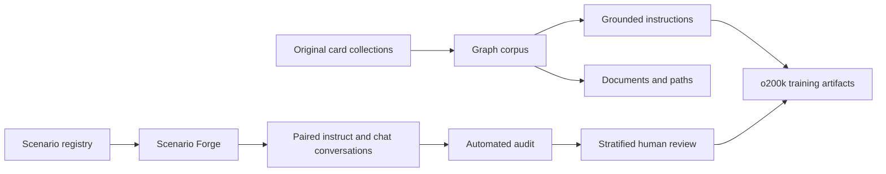

# Complexity Card Corpus

Complexity Card Corpus is an original, local-first dataset system for building
linked knowledge cards, grounded instructions, semantic assistant scenarios and
post-training conversations.

The editable sources are JSON card collections and semantic registries. Parquet
is the canonical dataset format, and o200k binary streams are optional derived
training artifacts. No third-party dataset is included in the public corpus.

> **Current status:** the knowledge-card and grounded-instruction collections
> are buildable. Scenario Forge is structurally validated. The post-training
> conversation set is still awaiting its required human review and is therefore
> not marked training-ready or release-ready.

## Why cards?

Cards separate meaning from surface wording. A source record can be inspected,
linked and corrected before it becomes prose or tokens. Generated artifacts
retain their source keys, semantic contract, split and provenance.



## Design principles

- **Original content:** released records are authored in this repository.
- **Inspectable artifacts:** readable JSON, JSONL or Parquet exists before
  tokenization.
- **Stable identity:** canonical hashes identify and verify semantic records;
  they do not choose language, safety rules or compatible combinations.
- **Explicit compatibility:** domain, intent, state, outcome, constraint, risk
  and fallback relationships are validated before prose is composed.
- **Grouped splits:** connected cards and paired scenario variants cannot leak
  across train and validation through different renderings.
- **Human release gate:** automated uniqueness and repetition statistics never
  replace semantic and safety review.

## What is included?

### Linked card graph

Seven original collections currently compile into:

| Artifact | Count |
| --- | ---: |
| Cards | 21,602 |
| Typed relations | 143,026 |
| Entity documents | 21,602 |
| Neighborhood documents | 21,594 |
| Multi-hop path documents | 86,144 |
| Total documents | 129,340 |

The collections cover original fantasy worlds, speculative natural history,
islands, computing foundations and systems foundations. Large collections are
produced from editable Atlas Forge blueprints with stable keys and validated
relation targets.

Each collection under `data/source/` contains:

- `dataset.json` — identity, domain, version, language, split and license;
- `cards.json` — typed cards, summaries, facts, attributes and relations.

The graph build writes `cards.parquet`, `relations.parquet`,
`documents.parquet` and a provenance-rich `manifest.json`.

### Grounded instruction set

The card graph deterministically produces **204,471** grounded examples:

| Mode | Examples |
| --- | ---: |
| One-turn instruction | 182,872 |
| Multi-turn chat | 21,599 |
| Train | 204,264 |
| Validation | 207 |

Tasks include summaries, attribute and fact queries, direct relations,
comparisons, structured extraction, grounded follow-ups and multi-hop paths.
Every example retains its source-card keys and evidence.

### Scenario Forge

Scenario Forge compiles **2,000** semantic scenarios across 45 domains and
seven assistant families:

| Family | Scenarios |
| --- | ---: |
| Practical action | 600 |
| Explanation and learning | 400 |
| Troubleshooting | 300 |
| Writing and transformation | 250 |
| Planning and comparison | 200 |
| Conversation and empathy | 150 |
| Safety and uncertainty | 100 |

Each scenario combines a compatible family, domain, intent, state, outcome,
constraint, risk-aware fallback and domain-specific trigger. The registry owns
the semantic matrices; the language layer only realizes an already-valid
combination.

The scenario audit requires:

- 2,000 unique IDs, signatures, titles, objectives and situations;
- exactly 1,900 train and 100 validation scenarios;
- zero shared `(family, domain, intent)` groups across splits;
- complete family allocation and compatible semantic payloads;
- one creation hash over the semantic signature and one verification hash over
  the canonical rendered record;
- surface linting for punctuation, morphology, suspicious verb chains and
  required semantic anchors.

`scenarios.parquet` is canonical. `scenarios.jsonl` is provided for readable
inspection.

### Post-training conversations

Every scenario produces two paired but independently worded examples:

- one two-message instruction;
- one four-message chat.

The modes share the same `scenario_id`, state, constraint and desired outcome,
but they do not copy the same user opening. The build rejects an exact first
message match or a chat opener that is a literal prefix of its paired instruct
prompt.

The current generated set contains:

| Measure | Value |
| --- | ---: |
| Examples | 4,000 |
| Source scenarios | 2,000 |
| Train / validation | 3,800 / 200 |
| Instruct / chat | 2,000 / 2,000 |
| Exact conversation uniqueness | 100% |
| Exact final-response uniqueness | 100% |
| Exact masked-skeleton uniqueness | 100% |
| Realized narrative combinations | 3,752 |
| Largest individual surface-form share | 3.75% |
| Largest masked eight-token coverage | 4.35% |
| Largest fallback-form share | 3.95% |
| Largest conclusion-frame share | 4.18% |

These are anti-template diagnostics, not a claim that every answer is correct
or naturally written. Raw source anchors remain visible in unmasked statistics;
subjects, intents, states, constraints, outcomes and fallbacks are masked only
when measuring response-template repetition.

## Human review

The post-training build creates `human_review.csv` with 140 pending rows:

- 70 unique source scenarios;
- both modes for each selected scenario;
- 20 rows from each assistant family;
- stratification across family, risk, split and domain.

Reviewers grade:

1. semantic accuracy;
2. constraint following;
3. language quality;
4. individualization;
5. safety.

They must also record `review_status`, reviewer identity, UTC review time and
optional notes. Readiness is reported only when every selected source scenario
has complete passing reviews. The sample is a quality-control gate, not proof
that the full corpus is error-free.

```bash
uv run card-corpus audit-post-training-review \
  --review build/post-training/human_review.csv
```

## Quick start

Requirements: Python 3.11+ and [uv](https://docs.astral.sh/uv/).

```bash
git clone https://github.com/Complexity-ML/complexity-card-corpus.git
cd complexity-card-corpus
uv sync --extra dev
```

Build the linked card corpus and grounded instructions:

```bash
uv run card-corpus build \
  --source data/source \
  --output build/corpus

uv run card-corpus build-instruct \
  --corpus build/corpus \
  --output build/atlas-instruct
```

Build Scenario Forge and the post-training review set:

```bash
uv run card-corpus build-scenario-forge \
  --registry data/scenario-forge/scenario-forge-v1.json \
  --output build/scenario-forge

uv run card-corpus build-post-training \
  --scenarios build/scenario-forge/scenarios.parquet \
  --output build/post-training \
  --variants-per-scenario 2 \
  --review-scenarios 70
```

Run the complete test suite:

```bash
uv run pytest -q
```

## Tokenization

Readable artifacts can be converted with an o200k tokenizer after inspection
and review:

```bash
uv run card-corpus tokenize \
  --documents build/corpus/documents.parquet \
  --tokenizer /path/to/tokenizer-o200k \
  --output build/tokenized/o200k

uv run card-corpus tokenize-instruct \
  --instructions build/atlas-instruct \
  --tokenizer /path/to/tokenizer-o200k \
  --output build/atlas-instruct-o200k
```

Document token streams use little-endian `uint32`, because o200k token IDs do
not fit in `uint16`. Causal-SFT labels use `-100` for user prefixes and padding;
only assistant tokens and the terminating EOS token contribute to the loss.

## Repository layout

```text
data/source/                         original linked-card collections
data/forge/                          editable large-deck blueprints
data/scenario-forge/                 semantic scenario registry
src/complexity_card_corpus/          build, language, audit and CLI modules
tests/                               regression and release-boundary tests
docs/post-training-reference-audit.md aggregate methodology reference
build/                               generated local artifacts (ignored)
```

The public release excludes locally inspected third-party corpora and their
derivatives. Private structural comparisons may inform audits, but external
utterances, phrases, source order and record identifiers are not part of this
repository or its released datasets.

## Licensing

The repository is deliberately dual-licensed by path. The licenses are not
interchangeable:

| Scope | License |
| --- | --- |
| `src/`, `tests/`, packaging and CLI code | [Apache License 2.0](LICENSE) |
| `data/` and derived dataset artifacts | [CC BY-NC 4.0](DATASET_LICENSE.md) |
| Project documentation | Apache License 2.0 |

Third-party content is outside the release boundary and is not relicensed by
this project. [`REUSE.toml`](REUSE.toml) records the path mapping in
machine-readable SPDX form. The Python wheel contains only Apache-2.0 software
and notices; Hugging Face dataset packages contain the separate CC BY-NC data
notice. See [NOTICE](NOTICE) for software attribution.
