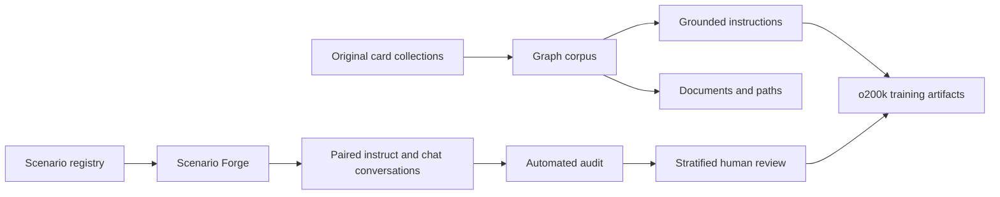
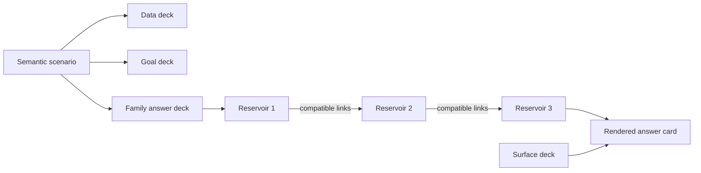

# Complexity Card Corpus

Complexity Card Corpus is an original, local-first dataset system for building
linked knowledge cards, grounded instructions, semantic assistant scenarios and
post-training conversations.

The editable sources are JSON card collections and semantic registries. Parquet
is the canonical dataset format, and o200k binary streams are optional derived
training artifacts. No third-party dataset is included in the public corpus.

> **Current status:** the knowledge-card and grounded-instruction collections
> are buildable. The four-surface Scenario Forge build produces 43,199 readable
> conversations after exact transcript/response cleanup and family capping.
> The automated release gate remains false; the 100K training-example target
> and separate stratified human review have not yet been satisfied.

## Why cards?

Cards separate meaning from surface wording. A source record can be inspected,
linked and corrected before it becomes prose or tokens. Generated artifacts
retain their source keys, semantic contract, split and provenance.



## Design principles

- **Original content:** released records are authored in this repository.
- **Inspectable artifacts:** readable JSON, JSONL or Parquet exists before
  tokenization.
- **Stable identity:** canonical hashes identify and verify semantic records;
  they do not choose language, safety rules or compatible combinations.
- **Explicit compatibility:** domain, intent, state, outcome, constraint, risk
  and fallback relationships are validated before prose is composed.
- **Grouped splits:** connected cards and paired scenario variants cannot leak
  across train and validation through different renderings.
- **Human release gate:** automated uniqueness and repetition statistics never
  replace semantic and safety review.

## What is included?

### Linked card graph

Seven original collections currently compile into:

| Artifact | Count |
| --- | ---: |
| Cards | 21,602 |
| Typed relations | 143,026 |
| Entity documents | 21,602 |
| Neighborhood documents | 21,594 |
| Multi-hop path documents | 86,144 |
| Total documents | 129,340 |

The collections cover original fantasy worlds, speculative natural history,
islands, computing foundations and systems foundations. Large collections are
produced from editable Atlas Forge blueprints with stable keys and validated
relation targets.

Each collection under `data/source/` contains:

- `dataset.json` — identity, domain, version, language, split and license;
- `cards.json` — typed cards, summaries, facts, attributes and relations.

The graph build writes `cards.parquet`, `relations.parquet`,
`documents.parquet` and a provenance-rich `manifest.json`.

### Grounded instruction set

The card graph deterministically produces **204,471** grounded examples:

| Mode | Examples |
| --- | ---: |
| One-turn instruction | 182,872 |
| Multi-turn chat | 21,599 |
| Train | 204,264 |
| Validation | 207 |

Tasks include summaries, attribute and fact queries, direct relations,
comparisons, structured extraction, grounded follow-ups and multi-hop paths.
Every example retains its source-card keys and evidence.

### Scenario Forge

Scenario Forge compiles **15,000** semantic scenarios across 14 assistant
families:

| Family | Scenarios |
| --- | ---: |
| Practical action | 750 |
| Explanation and learning | 650 |
| Troubleshooting | 500 |
| Writing and transformation | 400 |
| Planning and comparison | 200 |
| Conversation and empathy | 500 |
| Safety and uncertainty | 400 |
| Grounded question answering | 2,260 |
| Summarization and synthesis | 2,100 |
| Extraction and classification | 2,100 |
| Reasoning and verification | 2,540 |
| Critique and revision | 600 |
| Brainstorming and creativity | 1,400 |
| Context clarification | 600 |

Each scenario combines a compatible family, domain, intent, state, outcome,
constraint, risk-aware fallback and domain-specific trigger. The registry owns
the semantic matrices; the language layer only realizes an already-valid
combination.

The scenario audit requires:

- 15,000 unique IDs, signatures, titles, objectives and situations;
- exactly 14,250 train and 750 validation scenarios;
- zero shared `(family, domain, intent)` groups across splits;
- complete family allocation and compatible semantic payloads;
- one creation hash over the semantic signature and one verification hash over
  the canonical rendered record;
- eight source cards joined by 12 verified semantic links, with no orphan card
  and one connected graph per scenario;
- surface linting for punctuation, morphology, suspicious verb chains and
  required semantic anchors.

`scenarios.parquet` is canonical. `scenarios.jsonl` is provided for readable
inspection.

### Post-training conversations

Each source scenario can produce paired but independently worded examples:

- one two-message instruction;
- one four-message chat.

Each example is dealt as a four-card hand:

- **Situation** establishes the concrete case;
- **Data** supplies the facts that may be used;
- **Rule** states the operative constraint;
- **Goal** defines the required result.

Every data, goal and answer card is itself assembled from a linked deck of
named subcard reservoirs. A reservoir contains interchangeable fragments with
one semantic role, such as evidence, diagnostic, action, verification or
fallback. Explicit edges determine which fragments may follow one another;
dealing a card walks that graph instead of independently concatenating random
phrases. All 14 task families use this mechanism. Most answers also contain a
nested family deck inside a small surface deck, so wording can vary without
changing the family contract.

Every semantic answer reservoir currently contains at least three authored
subcards. Exact source records may remain single-valued at the input layer, but
the answer layer cannot rely on a singleton formulation. A regression test
checks this depth across every registered family and domain.



The compact topology of every dealt card is retained in
`answer_json.card_hand.deck_topology`. It records deck lineage, pool names and
pool sizes plus adjacent link counts without duplicating the full edge graph in
every row. The post-training registry does not include the separate Aethoria or
Prismwilds card collections; those exist only in the knowledge-corpus build.

All 14 families have their own completion contract. A grounded-QA hand must
separate supported evidence from unknown information, an extraction hand must
return the requested JSON fields, and a planning hand must provide criteria,
choice, sequence and fallback. The build validates these contracts before an
example can enter the corpus.

The modes share the same `scenario_id`, state, constraint and desired outcome,
but they do not copy the same user opening. Eight instruct-opening cards and
eight chat-opening cards are dealt independently. The build rejects an exact
first-message match or a chat opener that is a literal prefix of its paired
instruct prompt.

The current generated set contains:

| Measure | Value |
| --- | ---: |
| Readable examples after exact cleanup | 43,199 |
| Source scenarios represented | 14,466 |
| Train / generated validation | 40,952 / 2,247 |
| Instruct / chat | 21,577 / 21,622 |
| Exact conversation uniqueness | 100% |
| Exact final-response uniqueness | 100% |
| Distinct masked response skeletons | 22,518 |
| Masked response-skeleton uniqueness | 52.13% |
| Largest exact masked-skeleton share | 0.30% |
| Families with validated completion contracts | 14 / 14 |
| Families with linked data/goal/answer decks | 14 / 14 |
| Smallest semantic answer reservoir | 3 subcards |
| Largest masked eight-token coverage | 3.84% |
| Largest family-level masked-template share | 2.60% |
| Observed conversation vocabulary | 3,123 |
| Conversations mapped to vocabulary metadata | 15,912 |
| Statistical vocabulary terms mapped | 4,097 |
| Arbitrary vocabulary labels surfaced in conversations | 0 |

These are anti-template diagnostics, not a claim that every answer is correct
or naturally written. The masked figures intentionally report the reusable
language structures more honestly than identifier-driven exact uniqueness. Raw
source anchors remain visible in unmasked statistics; subjects, intents,
states, constraints, outcomes, fallbacks, IDs, dates, amounts, times and numeric
slots are masked only when measuring response-template repetition.

### 100K scale contract

The semantic nucleus contains 15,000 source cards. A 100,000-row release
therefore requires at least seven genuinely distinct retained surfaces per
source card. The planned budget is eight, giving a 120,000-row
pre-deduplication ceiling. This is a capacity calculation, not a claim that
those rows have already been generated.

Every build records `audit.scale_100k`. It refuses to equate fresh identifiers
with fresh training data and measures staticity after masking subjects, states,
constraints, IDs, numbers, dates and other surface variables. The target is
ready only when all of the following hold on materialized rows:

- exact final-response uniqueness is 100%;
- masked response-skeleton uniqueness is at least 8%;
- no masked skeleton covers 1% of the corpus;
- no masked eight-token span covers 4% of the corpus;
- no family-local masked template covers 5% of its family;
- at least 100,000 rows have actually been generated.

The audit reports `static_surface_hotspots`, so a narrow renderer stays visible
even when every row has a different hash or scenario code. Source-card
staticity is measured independently across family, domain, intent, constraint,
state, outcome, fallback and risk axes.

### Natural SFT projection

The readable Parquet keeps the four authored source cards for inspection. The
tokenized SFT projection deals a second, invisible conditioning hand that
controls how those semantics become a natural request:

- seven surface forms and eight dialogue states;
- twelve output contracts and fourteen reasoning patterns;
- evidence, uncertainty and context-density controls;
- thirteen style variants plus bounded irrelevant-detail noise.

These conditioning cards are recorded per example in `examples.jsonl` and
aggregated in each `sft.idx.json`. They never appear as literal card labels in
the model text. Regression tests decode generated SFT streams and require zero
`SITUATION CARD`, `DATA CARD`, `RULE CARD`, `GOAL CARD` or hand-ID prefixes. The
same projection removes authoring labels such as `Core idea`, `Equation`,
`Weakness`, `Immediate action` and `Open point`, plus generic completion rubrics
and hand identifiers, while retaining their semantic content as direct
assistant prose. Each family owns several answer structures: calculation,
explanation, comparison, planning and conversation keep their native form
instead of being forced into a universal report format.

Before tokenization, exact repeated assistant responses are removed. Volatile
identifiers, dates, times, amounts, quoted values and list numbering are then
normalized into a structural signature, with at most 48 retained examples per
`(family, signature)` pair. Extraction JSON uses a schema-aware ceiling of 512
because repeated field order is part of the output contract rather than prose
duplication. On the current strict build this yields 12,007 training examples,
28 separately authored evaluation examples and 672 source-separated
diagnostics. The tokenized artifact contains 750,116 supervised tokens in
total, including 726,565 for training. The retained training set has 100% exact
prompt and response uniqueness, 65.99% distinct normalized
`(family, structure)` pairs, and a 27.80% multi-turn share. It still spans all
nine conditioning axes, with 7
surface, 8 dialogue, 12 output, 14 reasoning, 4 evidence, 13 style, 3 density,
2 noise and 5 uncertainty values.

Evaluation does not reuse Scenario Forge's validation renderers. The v2 suite
contains 700 exchanges, exactly 50 per family: 28 separately authored gold
examples and 672 diagnostics generated by an evaluation-only script. The
tokenization audit requires zero normalized answer-structure overlap with
retained training examples and records both provenances without conflating them.
The diagnostics are source-separated held-out cases, not 672 manually authored
gold examples.

## Human review

The post-training build creates `human_review.csv` with 280 pending rows:

- 140 unique source scenarios;
- both modes for each selected scenario;
- 20 rows from each assistant family;
- stratification across family, risk, split and domain.

Each review row contains the complete transcript—including both turns of a
chat example—rather than only its opening prompt. This keeps the rule, goal,
assistant response and conversational transition visible during review.

Reviewers grade:

1. semantic accuracy;
2. constraint following;
3. language quality;
4. individualization;
5. safety.

They must also record `review_status`, reviewer identity, UTC review time and
optional notes. Readiness is reported only when every selected source scenario
has complete passing reviews. The sample is a quality-control gate, not proof
that the full corpus is error-free.

```bash
uv run card-corpus audit-post-training-review \
  --review build/post-training/human_review.csv
```

## Quick start

Requirements: Python 3.11+ and [uv](https://docs.astral.sh/uv/).

```bash
git clone https://github.com/Complexity-ML/complexity-card-corpus.git
cd complexity-card-corpus
uv sync --extra dev
```

Build the linked card corpus and grounded instructions:

```bash
uv run card-corpus build \
  --source data/source \
  --output build/corpus

uv run card-corpus build-instruct \
  --corpus build/corpus \
  --output build/atlas-instruct
```

Build Scenario Forge and the post-training review set:

```bash
uv run card-corpus build-scenario-forge \
  --registry data/scenario-forge/scenario-forge-v1.json \
  --output build/scenario-forge

uv run card-corpus build-post-training \
  --scenarios build/scenario-forge/scenarios.parquet \
  --vocabulary-placement data/vocabulary/vocabulary-placement-v1.csv \
  --output build/post-training \
  --variants-per-scenario 4 \
  --review-scenarios 140
```

## Vocabulary mining

Vocabulary breadth is measured separately from semantic coverage. The local
lexical mine retains normalized single tokens and aggregate statistics only:
no source sentence, phrase, identifier or n-gram enters the repository or the
generated corpus. The private mine is compared with the current conversations
to produce an authoring queue:

```bash
uv run card-corpus build-vocabulary-gap \
  --lexicon /private/mine/lexicon.parquet \
  --conversations build/post-training/conversations.parquet \
  --output build/vocabulary-gap \
  --min-sources 2 \
  --min-occurrences-per-source 20
```

The current two-source audit finds 4,097 cross-source words absent from the
original 1,533-word conversation vocabulary. Statistical placement uses masked
context windows, semantic-role priors and the real Scenario Forge capacity:

```bash
uv run card-corpus place-vocabulary \
  --review build/vocabulary-gap/vocabulary_review.csv \
  --lexicon /private/mine/lexicon.parquet \
  --registry /private/mine/sources.json \
  --raw /private/mine/raw \
  --scenarios build/scenario-forge/scenarios.parquet \
  --output build/vocabulary-placement
```

The versioned dictionary at
`data/vocabulary/vocabulary-dictionary-v1.json` contains all 4,097 words. A
word has one selected placement for generation plus up to four alternative
contexts in `statistical_usages`; a word is never assumed to have only one
meaning. If a later family rebalance exhausts the selected cell, generation
moves only the overflowing terms to a recorded statistical alternative, then
to a deterministic same-family cell as a final capacity fallback. Every
entry also carries its full 101-cell score vector and masked-token neighbours.

The current classification audit reports 2,111 statistically supported,
1,271 statistically plausible and 715 `review_required` entries. These labels
are confidence tiers, not lexical truth. The vocabulary-augmented build uses
all 4,097 terms in 8,194 conversations and raises observed vocabulary to 5,637,
but the corpus remains blocked on the human review gate.

An optional Open English WordNet comparison evaluates agreement without using
WordNet to author definitions:

```bash
uv sync --extra wordnet-audit
uv run wn download 'oewn:2025+'
uv run card-corpus audit-vocabulary-wordnet \
  --dictionary data/vocabulary/vocabulary-dictionary-v1.json \
  --output build/vocabulary-placement/wordnet-alignment.json
```

On the current dictionary, WordNet resolves 98.41% of entries. Among the
97.75% with a comparable proxy vector, the selected family appears in the
WordNet-derived top 1, 3 and 5 for 20.72%, 54.56% and 75.06% respectively.
This is a semantic-proxy agreement check, not a ground-truth accuracy score.

Run the complete test suite:

```bash
uv run pytest -q
```

## Tokenization

Readable artifacts can be converted with an o200k tokenizer after inspection
and review:

```bash
uv run card-corpus tokenize \
  --documents build/corpus/documents.parquet \
  --tokenizer /path/to/tokenizer-o200k \
  --output build/tokenized/o200k

uv run card-corpus tokenize-instruct \
  --instructions build/post-training/conversations.parquet \
  --supplement build/conversation-surface-10k/conversations.parquet \
  --tokenizer /path/to/tokenizer-o200k \
  --heldout-evaluation data/evaluation/generalist-heldout-v2.json \
  --output build/post-training-o200k
```

Document token streams use little-endian `uint32`, because o200k token IDs do
not fit in `uint16`. Causal-SFT labels use `-100` for user prefixes and padding;
only assistant tokens and the terminating EOS token contribute to the loss.
The tokenized release also carries `chat_template.json`. Its
`complexity-chat-v1` contract serializes the fixed system instruction, natural
user content, assistant prefixes, and EOS identically for training, evaluation,
export, and inference. Two-turn examples remain direct. Synthetic four-turn
card hands are flattened into one complete request and one direct answer unless
clarification is itself the task. This prevents the model from learning to ask
for an outcome and constraint that the user has already supplied. Genuine
non-card dialogue remains multi-turn. Visible card and hand identifiers remain
audit metadata and do not become model text.
`--supplement` is repeatable. Each source path and digest is recorded in the
manifest, duplicate IDs across sources are rejected, and original conversation
surfaces are assigned to canonical SFT families from their realized final
dialogue stage. For example, a practical dialogue that ends by asking for one
missing fact is classified as context clarification rather than practical
action merely because it came from the practical source bucket.
When `--heldout-evaluation` is supplied, generated validation conversations are
excluded. The binary `eval` shard contains only the 28 separately authored gold
exchanges. The 672 deterministic, source-separated cases are emitted as a
distinct `diagnostic` shard; they can support coverage checks but must not be
presented as independently authored validation data or used as the sole early
stopping signal. `manifest.json` records both provenances, structural
deduplication, target diversity by family, the held-out file hash and
train/evaluation overlap. The same output directory contains
`projected.parquet`: the exact retained model-facing conversations after
exact-response cleanup, family capping and structural repetition control.

The current strict projection is intentionally **not release-ready**. It retains
9,433 train examples with 508,193 supervised tokens after removing 26,083 exact
answer duplicates, 787 exact prompt conflicts, and repeated normalized answer
shapes. It contains 2,637 genuine multi-turn examples (27.96%) and only 34
synthetic multi-turn card hands. Exact train prompt and answer uniqueness are
both 100%, and recurrent fallback labels no longer create artificial diversity.
The remaining failures are explicit:
practical action and conversation empathy are still overrepresented; critique,
grounded QA and explanation remain underrepresented; only 275 answers exceed
80 words; and supervised volume remains below the 3–10 million token target.
These gaps must be addressed by authoring more genuinely distinct answers and
conversations in the weak families, not by loosening deduplication or restoring
generic resolution paragraphs.

## Repository layout

```text
data/source/                         original linked-card collections
data/forge/                          editable large-deck blueprints
data/scenario-forge/                 semantic scenario registry
data/evaluation/                     independently authored held-out exchanges
data/vocabulary/                     statistical multi-usage dictionary
src/complexity_card_corpus/          CLI and compact cross-stage utilities
src/complexity_card_corpus/tasks/    the 14 assistant-family card contracts
src/complexity_card_corpus/scenarios/ scenario schema, compiler, audit and build
src/complexity_card_corpus/posttrain/ readable conversation rendering and review
src/complexity_card_corpus/sft/      natural projection, selection and tokenization
src/complexity_card_corpus/surfaces/ conversation-surface templates, rendering and audit
src/complexity_card_corpus/vocabulary/ lexical mining, statistics, dictionary and placement
tests/                               regression and release-boundary tests
docs/code-architecture.md            module boundaries and dependency direction
docs/post-training-reference-audit.md aggregate methodology reference
build/                               generated local artifacts (ignored)
```

Public implementation entry points live directly in their stage subpackages.
See [`docs/code-architecture.md`](docs/code-architecture.md) before adding a new
pipeline stage.

The public release excludes locally inspected third-party corpora and their
derivatives. Private structural comparisons may inform audits, but external
utterances, phrases, source order and record identifiers are not part of this
repository or its released datasets.

## Licensing

The repository is deliberately dual-licensed by path. The licenses are not
interchangeable:

| Scope | License |
| --- | --- |
| `src/`, `tests/`, packaging and CLI code | [Apache License 2.0](LICENSE) |
| `data/` and derived dataset artifacts | [CC BY-NC 4.0](DATASET_LICENSE.md) |
| Project documentation | Apache License 2.0 |

Third-party content is outside the release boundary and is not relicensed by
this project. [`REUSE.toml`](REUSE.toml) records the path mapping in
machine-readable SPDX form. The Python wheel contains only Apache-2.0 software
and notices; Hugging Face dataset packages contain the separate CC BY-NC data
notice. See [NOTICE](NOTICE) for software attribution.
