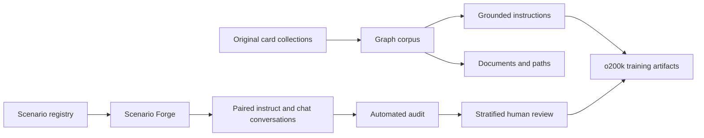
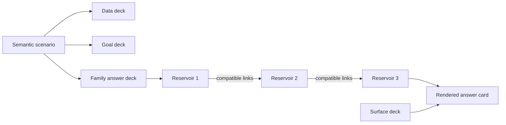

# Complexity Card Corpus

Complexity Card Corpus is an original, local-first dataset system for building
linked knowledge cards, grounded instructions, semantic assistant scenarios and
post-training conversations.

The editable sources are JSON card collections and semantic registries. Parquet
is the canonical dataset format, and o200k binary streams are optional derived
training artifacts. No third-party dataset is included in the public corpus.

> **Current status:** the knowledge-card and grounded-instruction collections
> are buildable. Scenario Forge now contains 33,320 semantic source scenarios
> backed by 14 editable family tanks. A 100K-row / 10M-supervised-token release
> remains a target until the expanded corpus is materialized, audited and
> separately reviewed; theoretical capacity is never reported as released data.

## Why cards?

Cards separate meaning from surface wording. A source record can be inspected,
linked and corrected before it becomes prose or tokens. Generated artifacts
retain their source keys, semantic contract, split and provenance.



## Design principles

- **Original content:** released records are authored in this repository.
- **Inspectable artifacts:** readable JSON, JSONL or Parquet exists before
  tokenization.
- **Stable identity:** canonical hashes identify and verify semantic records;
  they do not choose language, safety rules or compatible combinations.
- **Explicit compatibility:** domain, intent, state, outcome, constraint, risk
  and fallback relationships are validated before prose is composed.
- **Grouped splits:** connected cards and paired scenario variants cannot leak
  across train and validation through different renderings.
- **Human release gate:** automated uniqueness and repetition statistics never
  replace semantic and safety review.

## What is included?

### Linked card graph

Seven original collections currently compile into:

| Artifact | Count |
| --- | ---: |
| Cards | 21,602 |
| Typed relations | 143,026 |
| Entity documents | 21,602 |
| Neighborhood documents | 21,594 |
| Multi-hop path documents | 86,144 |
| Total documents | 129,340 |

The collections cover original fantasy worlds, speculative natural history,
islands, computing foundations and systems foundations. Large collections are
produced from editable Atlas Forge blueprints with stable keys and validated
relation targets.

Each collection under `data/source/` contains:

- `dataset.json` — identity, domain, version, language, split and license;
- `cards.json` — typed cards, summaries, facts, attributes and relations.

The graph build writes `cards.parquet`, `relations.parquet`,
`documents.parquet` and a provenance-rich `manifest.json`.

### Grounded instruction set

The card graph deterministically produces **204,471** grounded examples:

| Mode | Examples |
| --- | ---: |
| One-turn instruction | 182,872 |
| Multi-turn chat | 21,599 |
| Train | 204,264 |
| Validation | 207 |

Tasks include summaries, attribute and fact queries, direct relations,
comparisons, structured extraction, grounded follow-ups and multi-hop paths.
Every example retains its source-card keys and evidence.

### Scenario Forge

Scenario Forge compiles **33,320** semantic scenarios across 14 assistant
families:

| Family | Scenarios |
| --- | ---: |
| Practical action | 760 |
| Explanation and learning | 1,260 |
| Troubleshooting | 1,220 |
| Writing and transformation | 1,040 |
| Planning and comparison | 540 |
| Conversation and empathy | 520 |
| Safety and uncertainty | 400 |
| Grounded question answering | 3,660 |
| Summarization and synthesis | 3,600 |
| Extraction and classification | 5,280 |
| Reasoning and verification | 3,240 |
| Critique and revision | 6,000 |
| Brainstorming and creativity | 2,920 |
| Context clarification | 2,880 |

Each scenario combines a compatible family, domain, intent, state, outcome,
constraint, risk-aware fallback and domain-specific trigger. The registry owns
the semantic matrices; the language layer only realizes an already-valid
combination.

The scenario audit requires:

- 33,320 unique IDs, signatures, titles, objectives and situations;
- an approximately 5% grouped validation partition within a documented
  per-family tolerance;
- zero shared `(family, domain, intent)` groups across splits;
- complete family allocation and compatible semantic payloads;
- one creation hash over the semantic signature and one verification hash over
  the canonical rendered record;
- eight source cards joined by 12 verified semantic links, with no orphan card
  and one connected graph per scenario;
- surface linting for punctuation, morphology, suspicious verb chains and
  required semantic anchors.

`scenarios.parquet` is canonical. `scenarios.jsonl` is provided for readable
inspection.

#### Editable family tanks

Each assistant family lives in its own
`data/scenario-forge/tanks/<family>.json` file. The 14 tanks currently contain
8–20 authored domains and 41–54 raw semantic atoms each. Together they produce
585 distinct source cards and 6,061 realized source-link types. The domains,
contexts and compatibility rows are physical source data; increasing a target
count alone does not count as hydration.

The per-tank `weight` values are proportional allocation weights, not family
ceilings. `build-scenario-forge --target-scenarios N` distributes the requested
requested total across those weights and the compatible capacity actually
present in each domain. The CLI requires that total explicitly; 65k is only
the historical reproduction profile used by existing fixtures.

The tank audit reports authored atom counts, compatible signature capacity and
unused reserve independently:

```bash
uv run card-corpus audit-scenario-tanks \
  --registry data/scenario-forge/scenario-forge-v1.json
```

Regression tests require at least eight authored domains, 40 raw atoms and a
1.5× compatible-capacity reserve in every tank. Every registered domain must
also deal a valid concrete task hand before the corpus can build.

### Post-training conversations

Each source scenario can produce paired but independently worded examples:

- one two-message instruction;
- one four-message chat.

Each example is dealt as a four-card hand:

- **Situation** establishes the concrete case;
- **Data** supplies the facts that may be used;
- **Rule** states the operative constraint;
- **Goal** defines the required result.

Every data, goal and answer card is itself assembled from a linked deck of
named subcard reservoirs. A reservoir contains interchangeable fragments with
one semantic role, such as evidence, diagnostic, action, verification or
fallback. Explicit edges determine which fragments may follow one another;
dealing a card walks that graph instead of independently concatenating random
phrases. All 14 task families use this mechanism. Most answers also contain a
nested family deck inside a small surface deck, so wording can vary without
changing the family contract.

Every semantic answer reservoir currently contains at least three authored
subcards. Exact source records may remain single-valued at the input layer, but
the answer layer cannot rely on a singleton formulation. A regression test
checks this depth across every registered family and domain.



The compact topology of every dealt card is retained in
`answer_json.card_hand.deck_topology`. It records deck lineage, pool names and
pool sizes plus adjacent link counts without duplicating the full edge graph in
every row. The post-training registry does not include the separate Aethoria or
Prismwilds card collections; those exist only in the knowledge-corpus build.

All 14 families have their own completion contract. A grounded-QA hand must
separate supported evidence from unknown information, an extraction hand must
return the requested JSON fields, and a planning hand must provide criteria,
choice, sequence and fallback. The build validates these contracts before an
example can enter the corpus.

The modes share the same `scenario_id`, state, constraint and desired outcome,
but they do not copy the same user opening. Eight instruct-opening cards and
eight chat-opening cards are dealt independently. The build rejects an exact
first-message match or a chat opener that is a literal prefix of its paired
instruct prompt.

The current generated set contains:

| Measure | Value |
| --- | ---: |
| Readable examples after exact cleanup | 43,199 |
| Source scenarios represented | 14,466 |
| Train / generated validation | 40,952 / 2,247 |
| Instruct / chat | 21,577 / 21,622 |
| Exact conversation uniqueness | 100% |
| Exact final-response uniqueness | 100% |
| Distinct masked response skeletons | 22,518 |
| Masked response-skeleton uniqueness | 52.13% |
| Largest exact masked-skeleton share | 0.30% |
| Families with validated completion contracts | 14 / 14 |
| Families with linked data/goal/answer decks | 14 / 14 |
| Smallest semantic answer reservoir | 3 subcards |
| Largest masked eight-token coverage | 3.84% |
| Largest family-level masked-template share | 2.60% |
| Observed conversation vocabulary | 3,123 |
| Conversations mapped to vocabulary metadata | 15,912 |
| Statistical vocabulary terms mapped | 4,097 |
| Arbitrary vocabulary labels surfaced in conversations | 0 |

These are anti-template diagnostics, not a claim that every answer is correct
or naturally written. The masked figures intentionally report the reusable
language structures more honestly than identifier-driven exact uniqueness. Raw
source anchors remain visible in unmasked statistics; subjects, intents,
states, constraints, outcomes, fallbacks, IDs, dates, amounts, times and numeric
slots are masked only when measuring response-template repetition.

### Native casual-conversation family in V18

V18 adds a semantic casual-conversation family instead of converting task
instructions into artificial chat. Twenty-one topic cards and twenty context
cards are crossed with eight authored user intents and nine conversational
arcs. These dimensions are connected to stage-specific subcard decks for
openings, acknowledgements, follow-ups, topic shifts and context-aware
conclusions.
The dealer uses the shared `VariableBy2D` API: surface-function cells resolve
nested `topic[...]`, `context[...]`, `intent[...]`, `arc[...]`, and
`semantic[...]` cells, and every used cell is recorded in the model-invisible
deck topology.
It is rendered in memory by the global `tokenize-instruct` pipeline and written
directly into the unified projected Parquet and token shards. No separate casual
Parquet is created by the release build, and none of the other families is
removed.

The semantic capacity is `21 × 20 × 8 × 9 = 30,240` distinct four- or six-turn
English conversations. The five-percent split retains 28,728 training rows and
1,512 validation rows. Exact conversation and final-response uniqueness are
both 100%; no semantic unit crosses the split; every final response contains
one, two, or three coherent sentences, with all three length shapes represented.
Repetition is gated independently by role, exact
sentence, phrase, conversational function, model-facing six-word openings, and
known composition grammar defects. The builder refuses requests above 30,240:
scaling further requires a new topic, context, intent, or arc card, never a
repeated rendering of an existing semantic unit.

### 100K scale contract

The semantic nucleus contains 33,320 source cards. A 100,000-row release
therefore requires at least four genuinely distinct retained surfaces per
source card. The planned budget is eight, giving a 266,560-row
pre-deduplication ceiling. This is a capacity calculation, not a claim that
those rows have already been generated.

Every build records `audit.scale_100k`. It refuses to equate fresh identifiers
with fresh training data and measures staticity after masking subjects, states,
constraints, IDs, numbers, dates and other surface variables. The target is
ready only when all of the following hold on materialized rows:

- exact final-response uniqueness is 100%;
- masked response-skeleton uniqueness is at least 8%;
- no masked skeleton covers 1% of the corpus;
- no masked eight-token span covers 4% of the corpus;
- no family-local masked template covers 5% of its family;
- at least 100,000 rows have actually been generated.

The audit reports `static_surface_hotspots`, so a narrow renderer stays visible
even when every row has a different hash or scenario code. Source-card
staticity is measured independently across family, domain, intent, constraint,
state, outcome, fallback and risk axes.

### Natural SFT projection

The readable Parquet keeps the four authored source cards for inspection. The
tokenized SFT projection deals a second, invisible conditioning hand that
controls how those semantics become a natural request:

- seven surface forms and eight dialogue states;
- twelve output contracts and fourteen reasoning patterns;
- evidence, uncertainty and context-density controls;
- thirteen style variants plus bounded irrelevant-detail noise;
- response-structure cards for opening, clause order, semantic bridge and
  paragraph, line, bullet or numbered layout;
- four family-specific natural-dialogue axes for the opening, conversational
  link, grounded user update and direct-versus-linked depth.

These conditioning cards are recorded per example in `examples.jsonl` and
aggregated in each `sft.idx.json`. They never appear as literal card labels in
the model text. Regression tests decode generated SFT streams and require zero
`SITUATION CARD`, `DATA CARD`, `RULE CARD`, `GOAL CARD` or hand-ID prefixes. The
same projection removes authoring labels such as `Core idea`, `Equation`,
`Weakness`, `Immediate action` and `Open point`, plus generic completion rubrics
and hand identifiers, while retaining their semantic content as direct
assistant prose. Each family owns semantic clauses and compatible structure
decks: calculation, explanation, comparison, planning and conversation keep
their native form instead of being forced into a universal report format. The
structure hand changes only ordering and presentation; it cannot invent a fact
or conclusion. A per-family audit caps any one response-card hand at 5% of the
retained rows without duplicating rare hands.

SFT preparation audits repetition across the complete model-facing exchange.
For every family with at least 100 retained examples, no exact text, normalized
structure, 3/5/8-word opening or ending, complete sentence, internal 8-word
span, or response-card hand may appear in more than 5% of examples. Prompt and
response surfaces are measured separately. Structured JSON targets are exempt
from prose-shape checks, but not from exact-duplicate and card-hand checks. The
tokenizer fails before writing train shards and reports every offending family,
dimension, share and signature.

Before that hard gate, a corpus-level dealer considers 32 existing response-card
hands and renders only the least-used one. Candidate dealing hashes small card
records rather than producing 32 complete texts, so each example still requires
one full render. This adds no card axis and changes no task semantics; it only
prevents independent hashes from repeatedly selecting the same otherwise-valid
combination.

Before tokenization, exact repeated assistant responses are removed. Volatile
identifiers, dates, times, amounts, quoted values and list numbering are then
normalized into a structural signature, with at most eight retained examples
per `(family, signature)` pair. Extraction JSON uses a schema-aware ceiling of
32 because repeated field order is part of the output contract rather than
prose duplication. Exact counts and diversity measurements are emitted by each
build in `manifest.json`; generated artifacts are not described with stale
hard-coded counts in this README. The audit covers all seventeen conditioning
axes, including the four response-structure cards and four natural-dialogue
cards.

Evaluation does not reuse Scenario Forge's validation renderers. The v2 suite
contains 700 exchanges, exactly 50 per family: 28 separately authored gold
examples and 672 diagnostics generated by an evaluation-only script. The
tokenization audit requires zero normalized answer-structure overlap with
retained training examples and records both provenances without conflating them.
The diagnostics are source-separated held-out cases, not 672 manually authored
gold examples.

## Human review

The post-training build creates `human_review.csv` with 280 pending rows:

- 140 unique source scenarios;
- both modes for each selected scenario;
- 20 rows from each assistant family;
- stratification across family, risk, split and domain.

Each review row contains the complete transcript—including both turns of a
chat example—rather than only its opening prompt. This keeps the rule, goal,
assistant response and conversational transition visible during review.

Reviewers grade:

1. semantic accuracy;
2. constraint following;
3. language quality;
4. individualization;
5. safety.

They must also record `review_status`, reviewer identity, UTC review time and
optional notes. Readiness is reported only when every selected source scenario
has complete passing reviews. The sample is a quality-control gate, not proof
that the full corpus is error-free.

```bash
uv run card-corpus audit-post-training-review \
  --review build/post-training/human_review.csv
```

## Quick start

Requirements: Python 3.11+ and [uv](https://docs.astral.sh/uv/).

```bash
git clone https://github.com/Complexity-ML/complexity-card-corpus.git
cd complexity-card-corpus
uv sync --extra dev
```

Build the linked card corpus and grounded instructions:

```bash
uv run card-corpus build \
  --source data/source \
  --output build/corpus

uv run card-corpus build-instruct \
  --corpus build/corpus \
  --output build/atlas-instruct
```

Build Scenario Forge and the post-training review set:

```bash
uv run card-corpus build-scenario-forge \
  --registry data/scenario-forge/scenario-forge-v1.json \
  --output build/scenario-forge \
  --target-scenarios 80000

uv run card-corpus build-post-training \
  --scenarios build/scenario-forge/scenarios.parquet \
  --vocabulary-placement data/vocabulary/vocabulary-placement-v1.csv \
  --output build/post-training \
  --variants-per-scenario 8 \
  --workers 8 \
  --without-quality-audit \
  --review-scenarios 140
```

`--without-quality-audit` keeps source rendering separate from corpus
evaluation and records `quality_status: not_run`. The final model-facing
Parquet is audited once with `audit-projected-sft`; omitting the flag retains
the legacy inline source audit for compatibility and focused source QA.

## Vocabulary mining

Vocabulary breadth is measured separately from semantic coverage. The local
lexical mine retains normalized single tokens and aggregate statistics only:
no source sentence, phrase, identifier or n-gram enters the repository or the
generated corpus. The private mine is compared with the current conversations
to produce an authoring queue:

```bash
uv run card-corpus build-vocabulary-gap \
  --lexicon /private/mine/lexicon.parquet \
  --conversations build/post-training/conversations.parquet \
  --output build/vocabulary-gap \
  --min-sources 2 \
  --min-occurrences-per-source 20
```

The current two-source audit finds 4,097 cross-source words absent from the
original 1,533-word conversation vocabulary. Statistical placement uses masked
context windows, semantic-role priors and the real Scenario Forge capacity:

```bash
uv run card-corpus place-vocabulary \
  --review build/vocabulary-gap/vocabulary_review.csv \
  --lexicon /private/mine/lexicon.parquet \
  --registry /private/mine/sources.json \
  --raw /private/mine/raw \
  --scenarios build/scenario-forge/scenarios.parquet \
  --accepted-definitions data/vocabulary/vocabulary-definition-proposals-v1.json \
  --output build/vocabulary-placement
```

The versioned dictionary at
`data/vocabulary/vocabulary-dictionary-v1.json` contains all 4,097 words. A
word has one selected placement for generation plus up to four alternative
contexts in `statistical_usages`; a word is never assumed to have only one
meaning. If a later family rebalance exhausts the selected cell, generation
moves only the overflowing terms to a recorded statistical alternative, then
to a deterministic same-family cell as a final capacity fallback. Every
entry also carries its full 101-cell score vector and masked-token neighbours.

The current classification audit reports 2,111 statistically supported,
1,271 statistically plausible and 715 `review_required` entries. These labels
are confidence tiers, not lexical truth. The vocabulary-augmented build uses
all 4,097 terms in 8,194 conversations and raises observed vocabulary to 5,637,
but the corpus remains blocked on the human review gate.

An optional Open English WordNet comparison evaluates agreement without using
WordNet to author definitions:

```bash
uv sync --extra wordnet-audit
uv run wn download 'oewn:2025+'
uv run card-corpus audit-vocabulary-wordnet \
  --dictionary data/vocabulary/vocabulary-dictionary-v1.json \
  --output build/vocabulary-placement/wordnet-alignment.json
```

On the current dictionary, WordNet resolves 98.41% of entries. Among the
97.75% with a comparable proxy vector, the selected family appears in the
WordNet-derived top 1, 3 and 5 for 20.72%, 54.56% and 75.06% respectively.
This is a semantic-proxy agreement check, not a ground-truth accuracy score.

Run the complete test suite:

```bash
uv run pytest -q
```

Run the statistical quality audit after generation. It uses TF-IDF character
n-grams and deterministic sampling to detect near duplicates, train/evaluation
leakage, collapsed clusters, and ambiguous task-family surfaces:

```bash
uv run card-corpus audit-sklearn \
  --conversations build/post-training/conversations.parquet \
  --output build/post-training/sklearn-audit.json
```

Sampling, TF-IDF dimensions, clusters, and score batches scale from the
realized corpus size. Every row is still checked for exact duplication, basic
format validity, cluster assignment, family mismatch and surface outlier
score. The fitted statistical reference grows from the corpus instead of
remaining fixed at a 443k-row assumption.

SFT projection has no default 15k family cap and no default normalized-shape,
domain or response-hand truncation. It removes exact prompt/response duplicates
and reports the remaining distributions as ratios. Destructive caps exist only
as explicit `tokenize-instruct` recovery options for controlled ablations.

This complements the inexpensive exact checks for schema validity, duplicate
IDs and source-group leakage. Quality thresholds can fail a release without
silently deleting otherwise valid data.

An optional semantic-vector audit complements the lexical TF-IDF audit. It
uses the Apache-2.0 `sentence-transformers/all-MiniLM-L6-v2` checkpoint at a
pinned revision to embed the same deterministic sample. Prompts, responses and
their combined conversation are measured separately for semantic nearest
neighbors, cross-split proximity, cluster concentration, effective rank and
within-family dispersion:

```bash
uv sync --extra semantic-audit
uv run card-corpus audit-embeddings \
  --conversations build/post-training-32k/projected.parquet \
  --output build/post-training-32k/embedding-audit.json
```

Run response-level audits on `projected.parquet`, not on the authored card
representation. The projection is the natural prompt and target surface seen
by SFT; auditing the source cards instead would mostly measure repeated card
labels. Completion contracts are audited separately from the authored
conversation Parquet. The audit compares each natural intent with the distinct
legitimate contracts available inside its family. Intents that intentionally
share a contract are treated as equivalent candidates:

```bash
uv run card-corpus audit-contract-embeddings \
  --conversations build/post-training/conversations.parquet \
  --output build/post-training/contract-embedding-audit-minilm.json

uv run card-corpus audit-contract-embeddings \
  --conversations build/post-training/conversations.parquet \
  --output build/post-training/contract-embedding-audit-mxbai.json \
  --model mixedbread-ai/mxbai-embed-large-v1 \
  --revision b33106f585b9ce46904ad7443a3b52b7a63e231c
```

The structural checks require one non-empty contract per family-intent pair
and complete coverage of all fourteen families. Embedding alignment is a
diagnostic for reviewing whether the semantic field names express their
intent; it is not a reason to add artificial nesting or to reject two correct
JSON objects merely because they share a schema.

The embedding model truncates long inputs at its 256-wordpiece limit. The
report therefore labels these measurements as a statistical semantic
diagnostic, not proof of correctness or independence. A separate
`sft_readiness_proxy` summarizes repetition and response-collapse risk, but it
explicitly does not predict training loss, downstream accuracy or final model
quality.

The same embeddings can turn the internal masked-context dictionary into
semantic card decks and a build-priority plan. The fast corpus audit uses
MiniLM; dictionary review uses the stronger local Mixedbread encoder and then
cross-checks its candidates with MiniLM. Both checkpoints remain in the local
Hugging Face cache:

```bash
uv run card-corpus build-embedding-guidance \
  --dictionary data/vocabulary/vocabulary-dictionary-v1.json \
  --semantic-audit build/post-training/embedding-audit.json \
  --output build/post-training/embedding-guidance-mxbai.json \
  --model mixedbread-ai/mxbai-embed-large-v1 \
  --revision b33106f585b9ce46904ad7443a3b52b7a63e231c \
  --device mps

uv run card-corpus build-embedding-guidance \
  --dictionary data/vocabulary/vocabulary-dictionary-v1.json \
  --semantic-audit build/post-training/embedding-audit.json \
  --output build/post-training/embedding-guidance-minilm.json \
  --model sentence-transformers/all-MiniLM-L6-v2 \
  --revision 46605decb5369335a3847c9f41bb0b896c07dd1a \
  --device mps

uv run card-corpus build-dictionary-review \
  --primary-guidance build/post-training/embedding-guidance-mxbai.json \
  --secondary-guidance build/post-training/embedding-guidance-minilm.json \
  --proposals data/vocabulary/vocabulary-definition-proposals-v1.json \
  --output-json build/post-training/vocabulary-definition-review-v1.json \
  --output-csv build/post-training/vocabulary-definition-review-v1.csv

uv run card-corpus audit-definition-proposals \
  --dictionary data/vocabulary/vocabulary-dictionary-v1.json \
  --proposals data/vocabulary/vocabulary-definition-proposals-v1.json \
  --model mixedbread-ai/mxbai-embed-large-v1 \
  --revision b33106f585b9ce46904ad7443a3b52b7a63e231c \
  --device mps \
  --output build/post-training/definition-proposals-mxbai.json

uv run card-corpus audit-definition-proposals \
  --dictionary data/vocabulary/vocabulary-dictionary-v1.json \
  --proposals data/vocabulary/vocabulary-definition-proposals-v1.json \
  --model sentence-transformers/all-MiniLM-L6-v2 \
  --revision 46605decb5369335a3847c9f41bb0b896c07dd1a \
  --device mps \
  --output build/post-training/definition-proposals-minilm.json

uv run card-corpus merge-definition-proposal-audits \
  --primary build/post-training/definition-proposals-mxbai.json \
  --secondary build/post-training/definition-proposals-minilm.json \
  --output-json build/post-training/definition-proposals-review-v1.json \
  --output-csv data/vocabulary/definition-proposals-review-v1.csv

uv run card-corpus accept-definition-proposals \
  --dictionary data/vocabulary/vocabulary-dictionary-v1.json \
  --proposals data/vocabulary/vocabulary-definition-proposals-v1.json \
  --review data/vocabulary/definition-proposals-review-v1.csv \
  --output-dictionary data/vocabulary/vocabulary-dictionary-v1.json \
  --output-review data/vocabulary/definition-proposals-review-v1.csv \
  --accept-all
```

This guidance ranks nearby vocabulary cards inside the same task family and
identifies prompt or response decks that need expansion. It never labels the
neighbors as authoritative synonyms and never rewrites training prose without
the normal grammar and compatibility checks. The same artifact reports
token-to-gloss alignment, selected-family centroid rank, and agreement between
masked-context and embedding neighbors. Review selection is adaptive rather
than capped at an arbitrary percentage: it includes every entry with a
statistical `review_required` status, a robust embedding outlier, or a selected
family ranked below the top five by either model. The current union contains
1,133 entries: 181 are independently flagged by both embedding models and 952
remain uncertain. No gloss is empty. The editable review sheet keeps the
statistical gloss and proposed human definition in separate columns; no model
may overwrite the canonical dictionary automatically.
Proposal audits judge token-to-definition alignment. Movement relative to the
current family is reported separately but cannot veto a correction because the
review queue exists precisely when that family assignment may be wrong.
Each proposal is measured with two fixed probes: the bare token and the local
query `What is the meaning of the word "TOKEN"?`. Probe disagreement remains
visible instead of being forced into an acceptance or rejection.

## Tokenization

Readable artifacts can be converted with an o200k tokenizer after inspection
and review:

```bash
uv run card-corpus tokenize \
  --documents build/corpus/documents.parquet \
  --tokenizer /path/to/tokenizer-o200k \
  --output build/tokenized/o200k

uv run card-corpus project-instruct \
  --instructions build/post-training/conversations.parquet \
  --supplement build/conversation-surface-10k/conversations.parquet \
  --heldout-evaluation data/evaluation/generalist-heldout-v2.json \
  --reasoning-envelope-version v18 \
  --workers 8 \
  --output build/post-training-v18

uv run card-corpus audit-projected-sft \
  --artifact build/post-training-v18 \
  --workers 8

uv run card-corpus tokenize-projected-sft \
  --artifact build/post-training-v18 \
  --tokenizer /path/to/tokenizer-32k
```

The SFT release is deliberately split into resumable phases. Projection writes
`projected.parquet` and `projection-manifest.json` with
`quality_status: not_run`; it does not run the sklearn, style, repetition, or
release audits and does not tokenize. Auditing reads that exact Parquet and
writes `audit-manifest.json` with `passed` or `failed`. Tokenization reads the
same audited Parquet, writes only the binary shards and final `manifest.json`,
and never invokes a quality audit. It refuses a missing or failed audit by
default; `--allow-failed-audit` is reserved for diagnostic builds whose final
manifest remains not ready. Packaging and publication remain separate. The
legacy `tokenize-instruct` command is kept as an all-in-one compatibility
orchestrator for CI, not as the recommended iterative workflow.

V18 provides nested VariableBy2D think/final decks for five reasoning
families. It renders `<think>...</think><final>...</final>` only for the three
families that require internal deliberation in the released mix: calculation
and verification, constraint planning, and troubleshooting. Explanation and
critique keep direct model-facing answers. This holds the reasoning envelope
between 15% and 25% of training rows instead of teaching the model to deliberate
on every request. The tag protocol is fixed, while both sections are grounded
in each scenario. The release gate checks balanced
tags, scope, bounded lengths, per-family collisions, card-hand concentration,
and that every numeric value in a calculation final was established in its
think section. Other families, including original casual conversation, remain
natural and unwrapped.

Training a V18 build must consume these pre-rendered targets directly. Do not
also enable a runtime reasoning-envelope injector: that would double-wrap the
answer and bypass the corpus audit. A static runtime envelope is suitable only
for a short pipeline smoke test, not for judging the reasoning data.

`tokenize-instruct` deterministically renders the native casual family in
memory, merges it directly into the unified SFT rows, runs its role/function
repetition audit inside the global audit, and requires it to contribute at
least 5% of the training mix. The bundled semantic reservoir supplies 30,240 unique units
from topic, context, intent, and arc cards; 28,728 enter the training split.
Recycling an existing semantic unit does not count as new capacity.
`--without-casual-conversation` exists only for isolated tests and diagnostics.
V18 also requires the realized reasoning-envelope share to remain between 15%
and 25%, and no normalized six-word sentence opening may exceed 5% inside a
training family.

Document token streams use little-endian `uint32`, which also supports the
configured 32k tokenizer without coupling the file format to one vocabulary.
Causal-SFT labels use `-100` for user prefixes and padding;
only assistant tokens and the terminating EOS token contribute to the loss.
The tokenized release also carries `chat_template.json`. Its
`complexity-chat-v2` contract serializes natural user content, assistant
prefixes, and EOS identically for training, evaluation, export, and inference,
without injecting a default system instruction. The contract also records the
audited optional `<think>...</think><final>...</final>` protocol used by
reasoning-task targets. Two-turn examples remain direct. One deterministic card
hand in five is preserved as a linked four-turn dialogue: evidence first, then
one compatible clarification, objection, correction, follow-up or validation
move, followed by the requested outcome and boundary. The remaining card hands
become one complete request and one direct answer, so the model is not taught to
clarify every task. Separately authored non-card dialogue remains multi-turn.
Visible card and hand identifiers remain audit metadata and do not become model
text.
`--supplement` is repeatable. Each source path and digest is recorded in the
manifest, duplicate IDs across sources are rejected, and original conversation
surfaces are assigned to canonical SFT families from their realized final
dialogue stage. For example, a practical dialogue that ends by asking for one
missing fact is classified as context clarification rather than practical
action merely because it came from the practical source bucket.
When `--heldout-evaluation` is supplied, generated validation conversations are
excluded. The binary `eval` shard contains only the 28 separately authored gold
exchanges. The 672 deterministic, source-separated cases are emitted as a
distinct `diagnostic` shard; they can support coverage checks but must not be
presented as independently authored validation data or used as the sole early
stopping signal. `manifest.json` records both provenances, structural
deduplication, target diversity by family, the held-out file hash and
train/evaluation overlap. The same output directory contains
`projected.parquet`: the exact retained model-facing conversations after
exact-response cleanup, deterministic surface selection and structural
repetition auditing. Family or hand caps are manual opt-ins; the default build
preserves every non-exact row and reports realized ratios.

Release readiness is decided from the generated manifest, not the number of
source rows. The required checks include exact prompt and answer uniqueness,
zero train/evaluation normalized-structure overlap, bounded response-card-hand
share, family coverage and supervised-token volume. Remaining gaps must be
addressed by authoring genuinely distinct answers and conversations in weak
families, not by loosening deduplication or restoring generic resolution
paragraphs.

The audited v1.0.11 32k projection (2026-08-04) contains 402,893 examples,
including 402,193 training examples, 96,636,094 serialized tokens and
31,977,724 supervised assistant tokens. Exact training prompt and response
uniqueness is 100%, 22.09% of all examples are multi-turn, all 14 families are
represented, all 17 invisible conditioning axes are recorded and no internal
card or hand label remains in model-facing text. Binary lengths, indexes and
manifest counts agree for every partition. The minimum-family-share diagnostic
remains intentionally false because only 1,105 distinct training examples in
`brainstorming_creativity` survive removal of hand identifiers and exact
semantic duplicates; the release does not restore those duplicates merely to
meet a ratio. Embedding proximity remains a separate semantic diagnostic rather
than a release gate or a prediction of SFT quality.

## Repository layout

```text
data/source/                         original linked-card collections
data/forge/                          editable large-deck blueprints
data/scenario-forge/                 semantic registry and 14 editable family tanks
data/evaluation/                     independently authored held-out exchanges
data/vocabulary/                     statistical multi-usage dictionary
src/complexity_card_corpus/          CLI and compact cross-stage utilities
src/complexity_card_corpus/tasks/    the 14 assistant-family card contracts
src/complexity_card_corpus/scenarios/ scenario schema, compiler, audit and build
src/complexity_card_corpus/posttrain/ readable conversation rendering and review
src/complexity_card_corpus/sft/      natural projection, selection and tokenization
src/complexity_card_corpus/surfaces/ conversation-surface templates, rendering and audit
src/complexity_card_corpus/vocabulary/ lexical mining, statistics, dictionary and placement
tests/                               regression and release-boundary tests
docs/code-architecture.md            module boundaries and dependency direction
docs/post-training-reference-audit.md aggregate methodology reference
build/                               generated local artifacts (ignored)
```

Public implementation entry points live directly in their stage subpackages.
See [`docs/code-architecture.md`](docs/code-architecture.md) before adding a new
pipeline stage.

The public release excludes locally inspected third-party corpora and their
derivatives. Private structural comparisons may inform audits, but external
utterances, phrases, source order and record identifiers are not part of this
repository or its released datasets.

## Licensing

The repository is deliberately dual-licensed by path. The licenses are not
interchangeable:

| Scope | License |
| --- | --- |
| `src/`, `tests/`, packaging and CLI code | [Apache License 2.0](LICENSE) |
| `data/` and derived dataset artifacts | [CC BY-NC 4.0](DATASET_LICENSE.md) |
| Project documentation | Apache License 2.0 |

Third-party content is outside the release boundary and is not relicensed by
this project. [`REUSE.toml`](REUSE.toml) records the path mapping in
machine-readable SPDX form. The Python wheel contains only Apache-2.0 software
and notices; Hugging Face dataset packages contain the separate CC BY-NC data
notice. See [NOTICE](NOTICE) for software attribution.
