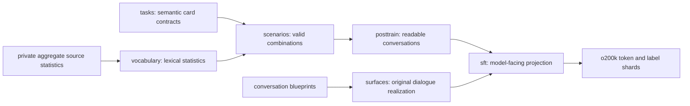

# Code architecture

The implementation is organized by dataset stage. Each stage owns a small
subpackage with explicit responsibilities, and the CLI imports these packages
directly.

## Package boundaries

- `tasks/` defines the 14 assistant families and their authored card hands.
  `registry.py` is the only family registry.
- `scenarios/` validates semantic compatibility before language is rendered.
  `schema.py` owns constants and matrices, `compiler.py` creates records,
  `audit.py` enforces invariants, and `build.py` writes artifacts.
- `posttrain/` turns scenarios into inspectable instruction and chat rows.
  Rendering, metrics, human-review selection and artifact writing are separate.
- `sft/` removes storage labels, creates natural model-facing exchanges,
  performs deduplication and family balancing, and writes token/label shards.
- `surfaces/` realizes original task-oriented and empathetic conversations from
  blueprints. Templates, rendering logic, audits and artifact writing are
  independent modules.
- `vocabulary/` keeps source access, aggregate lexical statistics, overlap
  audits, the masked dictionary and semantic placement separate. Released data
  never contains external source phrases.

## Dependency rules

1. Schema and constant modules do not import builders.
2. Rendering modules may depend on schemas and contracts, never on CLI code.
3. Audit modules inspect in-memory rows and do not write release artifacts.
4. Build modules orchestrate rendering, auditing and serialization.
5. `cli.py` calls public builders only.
6. Imports between subpackages follow the dataset flow above; circular imports
   are treated as architecture errors.

## Change checklist

When a stage changes:

1. add or update the focused test for that subpackage;
2. update direct package imports when a public entry point moves;
3. run `ruff check src tests` and `pytest -q`;
4. rebuild deterministic artifacts only when behavior intentionally changes.
